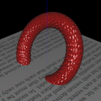
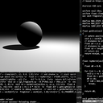

# Notes on Computer Graphics 

Exploratory programs on various topics related to 3D computer graphics.

By: Mahesh Venkitachalam ([electronut.in][1])

## Building the Examples

### Windows 

Install Visual Studio 2019. Clone this repo, create a *build* directory, cd into it from a VS 2019 cmd prompt and do:

```
cmake "Visual Studio 16" ..
```

This will create *nocg.sln* which you can load using Visual Studio. To run the torus application, right click on it in the Solution Explorer and select "Set as Startup Project". Now you can build and debug the project in Visual Studio. When you make major changes like adding new files, etc., clean out the *build* folder, run *cmake* again and reload *nocg.sln* in Visual Studio.

I have not tested the build with any other OS, but Linux support is coming soon.

## Examples 

| **Name** | **Description**|
|---|---|
| [][3]| [torus][3]: Rendering a Torus: Gouraud/Phong shading, Texturing, Procedural Textures, and Bump Mapping.|
| [][2]| [shaderjig][2]: A simple Python + OpenGL setup to play with fragment shaders.|


[1]: https://electronut.in/
[2]: https://github.com/mkvenkit/nocg/tree/main/shaderjig
[3]: https://github.com/mkvenkit/nocg/tree/main/src/torus
