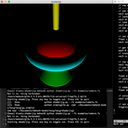

# Notes on Computer Graphics 

Exploratory programs on various topics related to 3D computer graphics.

By: Mahesh Venkitachalam ([electronut.in][1])

## Examples 

| **Name** | **Description**|
|---|---|
| [][3]| [torus][3]: Rendering a Torus: Gouraud/Phong shading, Texturing, Procedural Textures, and Bump Mapping.|
| [][2]| [shaderjig][2]: A simple Python + OpenGL setup to play with fragment shaders.|

[1]: https://electronut.in/
[2]: https://github.com/mkvenkit/nocg/tree/main/shaderjig
[3]: https://github.com/mkvenkit/nocg/tree/main/src/torus
