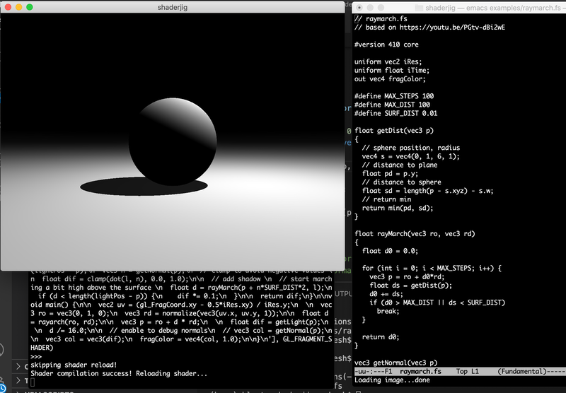

# shaderjig



A simple Python + OpenGL setup to play with fragment shaders. Inspired by 
Shadertoy.

## Installation 

shaderjig uses the following external Python modules:

**numpy**

https://numpy.org/install/

**PyOpenGL**

http://pyopengl.sourceforge.net/

**GLFW**

For this you need to install GLFW first:

https://www.glfw.org/download.html

Then you need the python binding *pyglfw*:

https://pypi.org/project/pyglfw/

Also, shaderjig uses OpenGL 4.1. 

# Running it

Run from a shell as:

```
python shaderjig.py --fs examples/raymarch.fs
```

Keep editing your fragment shader in any text editor, and as you save, the shader will be compiled and reloaded in the OpenGL window. Compilation errors will be printed on your terminal.

